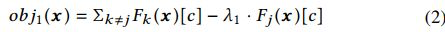
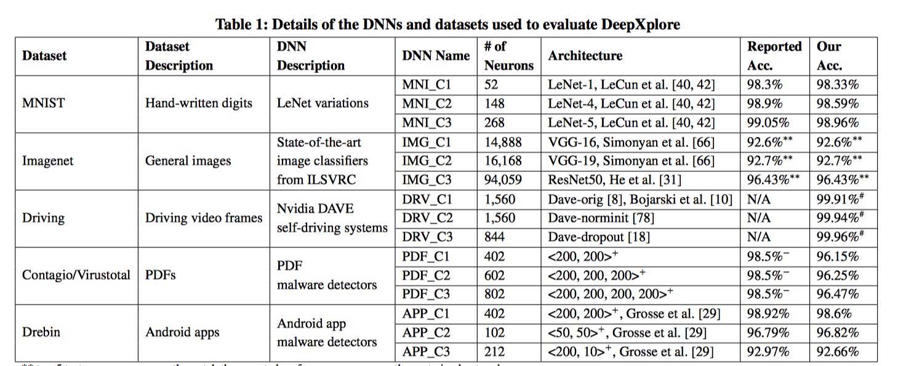
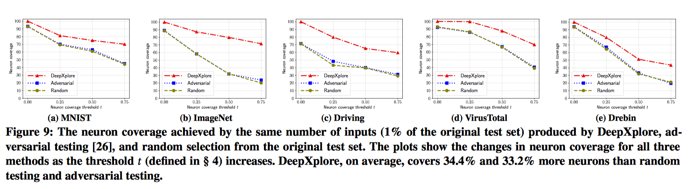

#  DeepXplore: Automated Whitebox Testing of Deep Learning Systems

## 1. 简介

深度学习（DL）系统在当下应用的越来越广泛，而现有的DL测试很大程度上依赖于手工标记数据，因此往往无法完全测试到所有情况，导致DL系统在实际运行中会在某些边缘情况可能存在误判。而这种误判，尤其是在类似自动驾驶领域，会导致十分严重的后果。针对这个问题，研究者设计与实现了DeepXplore，一个白盒DL测试审计框架。该框架引入神经元覆盖，系统地测量由测试输入执行的DL系统的部分，并利用多个具有类似功能的DL系统作为交叉引用预言，以避免手动检查。此外，DeepXplore生成的测试输入也可用于重新训练相应的DL模型，以将模型的精度提高3%

## 2. 相关介绍

##### 自动化大规模测试DL系统的挑战：

- 1. 如何生成能够触发不同逻辑行为的测试数据

- 2. 如何（在无标记情况下）识别DL系统的错误行为。

##### 传统测试的限制

- 1. 昂贵的标签成本：对大量DNN测试集打标签是一个很耗费人力成本的工作，而且我们也无法保证人力模式下打出来的标签是否正确。

- 2. 低测试覆盖率

##### 文章主要贡献

- 1. 引入神经元覆盖技术作为DL系统的第一个百合测试指标，可以估计一组测试输入所探测的DL逻辑数量

- 2. 证明寻找DL系统之间的大量行为差异并同时最大化神经元覆盖旅的问题可以被表述为联合优化问题，并提出了一种基于梯度的算法来有效解决这个问题

- 3. 研究者们将所有这些技术都实施为DeepXplore（一个白盒DL测试框架）

- 4. DeepXplore生成的测试集也可以用于重新培训相应的DL系统，并能将分类准确度提高3%

## 3. 相关实现

- 在TensorFlow和Keras深度学习框架上进行的实现

- DeepXplore主要解决联合优化问题，保证使差异行为和神经元覆盖率最大化。

- 生成过程中会有相应约束来保证测试集的实际性（与实际相符合，比如pdf文件要符合pdf规范）

- 设计了一个算法，用梯度上升来解决联合优化问题。这种生成测试用例的目标是诱导DL系统给出错误的预测。

  

  

- 对于一个软件系统测试来说，测试的完备性是一个重要的指标。而对于一个DL系统来说，其具体逻辑并不完全体现在代码的分支流程图上，而是其具体神经元相关（训练数据定义训练后代码执行逻辑）。因此，论文提出neuron coverage的指标来度量测试完备程度。对于DL系统来说，最后的结果实际上受到神经网络中每个神经元的影响。简单来看，神经元输出越大则对最终结果影响越大，因此作者提出设置一个threshold，如果神经元输出超过这个threshold则算是激活。因此，测试用例生成的目的则是最大化被激活的neuron总量。

- DeepXplore在所有测试的DNN中发现了很多很多错误，这些错误样本揭示了当前DNN模型的问题。与此同时，后续用这些样本继续训练时，可以提高原模型的正确率。

  文中针对上述类型的样本进行了测试，检测出来的效果很好，结果如下：

  

## 4. 相关思考

1. 该文章虽然在DL测试领域做出了一个很好的工作，但是距离真正完全实现DL系统测试还有很远的路要走。因为文章的测试模型只是在尝试从近似覆盖模型从训练数据中对比获得整个输入空间。而这种输入空间的获取，一个是相对较难，二是无法保证整个数据覆盖了所有输入，仍然可能存在一些未覆盖的点。

2. 这篇文章像我们展示了在深度学习领域的一些安全问题与考量，便于我们了解这个领域的前沿研究与学习思路

3. 文章讲述了DL系统下的一些测试挑战，那么我们能否测试一下机器学习方面的安全问题

4. 另外，针对DL领域的黑样本攻击是否也可以针对性地进行一些研究，如何特异性地自动构造黑样本攻击DL系统

   

## 5. 参考

1. [http://www.cs.columbia.edu/~junfeng/papers/deepxplore-sosp17.pdf](http://www.cs.columbia.edu/~junfeng/papers/deepxplore-sosp17.pdf)
2. [https://github.com/peikexin9/deepxplore](https://github.com/peikexin9/deepxplore)
3. [https://zhuanlan.zhihu.com/p/30457361](https://zhuanlan.zhihu.com/p/30457361)

#### 