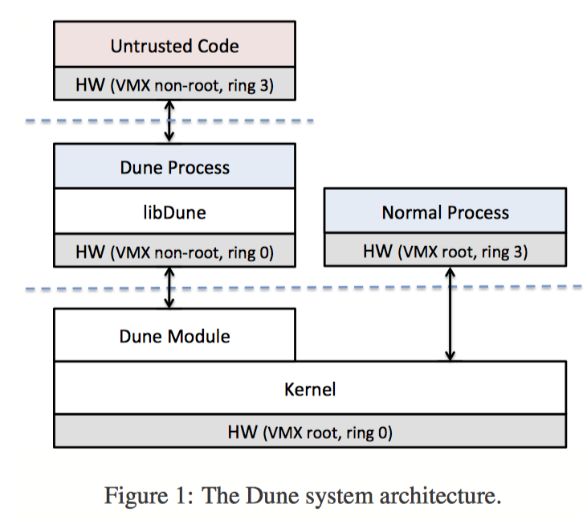
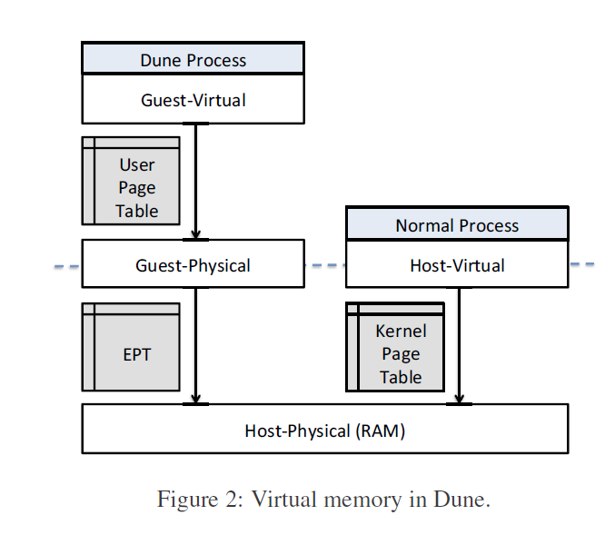

# Dune: Safe User-level Access to Privileged CPU Features

## 简介

Dune是一种能为应用程序提供直接但安全访问硬件能力（比如页表、快表等等）的系统。其在现代处理器中使用虚拟化硬件来提供过程，而非机器抽象。它由一个小型内核模块组成，该模块初始化虚拟化硬件并协调与内核的交互，以及一个帮助应用程序管理特权硬件功能的用户级库。

Dune提供了一个可加载的内核模块，可与未经修改的Linux内核配合使用。该模块允许进程进入“Dune模式”，通过虚拟化硬件，可以安全快速地访问特权硬件功能，包括特权模式、虚拟内存寄存器、页表以及中断，异常和系统调用。

### 相对于虚拟机的优点

1. Dune进程是一个普通的linux进程，唯一区别就是它使用VMCALL指令来调用系统调用。所以，它可以完全访问系统的其他部分，且Dune应用程序相对比较容易开发（为应用程序编程，而非内核编程）
2. 提供虚拟化硬件，而非机器抽象，使得该模块运行更简单，且快速

## 文章贡献

1. 提供了一种使用硬件辅助虚拟化的设计，以便在保留标准操作系统抽象的同时安全有效地将特权硬件功能暴露给用户程序。

2. 详细评估了三种硬件的功能并展示它们如何优化用户程序
3. 通过三种用例（沙箱、特权分离和垃圾回收）来试验和评估应用程序

## 主要内容

Dune给普通的用户应用程序一个对于CPU特性的安全高效的访问权限，而一般传统情况只有操作系统才能对内核进行访问。 它通过充分利用现代硬件虚拟化，使得在一个并非特权级别的情形下直接执行特权指令，使用Intel的VT-x虚拟化架构将异常，虚拟内存，特权模式，和分段机制的访问使用权限暴露出来。 通过在用户级使得这些硬件机制可以访问使用，Dune使得不用对内核进行专门的修改就可以部署全新的系统这种情形变得很方便。

Dune将CPU分为两种操作模式，分别是VMX root和VMX non-root模式。VMX root模式通常用来运行虚拟内存管理，除了能使新的指令来操作VT-x并不改变CPU的性能，而VMX non-root模式限制CPU性能，用来运行虚拟化的客户操作系统。两者的转换依靠硬件管理。

如图所示，在Dune下面的进程可以通过libDune运行在ring0态，属于VMX non-root，而正常进程是运行在ring3态 VMX root。

在内核支持方面，Dune的核心是一个管理Vt-x内核模块，对于高优先级的硬件特性有更高的权限，在管理内存，暴露特权级硬件的接口和保留访问内核接口的权限。

## 个人思考

随着应用的广泛与发展，越来越多的应用需要访问硬件特性的权限。而传统的Linux下，访问硬件权限需要进行用户/内核切换。这会带来额外的开销。对于这种问题，文章提出了一个解决方案就是使用硬件虚拟化来提供一个进程，该进程仅仅是一个用户态的普通程序，唯一区别在于它使用VMcall进行系统调用。因此，整体运行效能能得到保证。

这篇文章基于上述策略做了一个非常好的实现，为后续科研工作者进一步研发打好了基础。

## 参考

1. [https://www.usenix.org/system/files/conference/osdi12/osdi12-final-117.pdf](https://www.usenix.org/system/files/conference/osdi12/osdi12-final-117.pdf)

