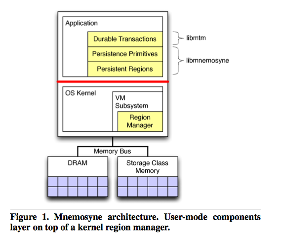

# Mnemosyne: Lightweight Persistent Memory

## 简介

 SCM技术通过定期存储器指令对非易失性存储器进行用户级访问。在这篇文章中，作者提出了Mnemosyne，一个用以持久内存编程的简单接口。Mnemosyne解决了两个难题：如何创建和管理持久内存、如何确保出现系统故障时内存的一致性。在Mnemsoyne中，程序员用关键字“pstatic”声明全局持久化数据或动态分配它。 Mnemosyne提供了用于直接修改持久变量的原语，并通过轻量级事务机制支持一致的更新。 与过去在基于磁盘的持久性内存方面的工作相比，Mnemosyne通过以更新的粒度将数据直接写入内存，而不是通过文件系统将内存页面写回磁盘，从而减少了存储延迟。 在模拟即将到来的SCM的性能特征的测试中，作者展示了Mnemosyne可以持续3微秒的数据。 此外，它在OpenLDAP目录服务器中的应用性能提高了35％。 在microbenchmark研究中，作者发现Mnemosyne比替代的持久性策略（例如Berkeley DB或Boost序列化）可以高达1400％，这些策略专为磁盘而设计。

## 主要内容

 Mnemosyne的目的是降低数据持久化的成本

 三个系统目标

1. 持久性的用户模式访问，从而避免内核/用户切换的延迟
2. 对数据的修改的一致性更新，并保证在系统故障时不会危害正确性
3. 对现有的处理器怀有兼容性

 持久化内存存储

 更新确保一致性

- Single variable update.
- Append updates.
- Shadow updates
- In-place updates

 将一致性映射到硬盘

 持久的内存交换

 防止内存泄漏

- 在分配过程中，Menosyne通过将持久内存交换到文件来虚拟化持久内存。这确保一个程序中的泄漏只影响该程序，并且不会降低吃就行内存对其他程序的可用性。发生泄漏时，程序可以通过分配新的永久区域并将现有数据从现有区域复制到新区域来恢复。

系统架构：

## 文章贡献

1. 提出了一个完整的分层体系结构，用于管理和向存储级内存展示程序
2. 探索对内存数据进行一致更新的机制，以及支持对数据存储级内存进行一致更新的基元库
3. 为SCM提供了持久性的软件事务内存系统
4. 实现了一种新颖的原子日志写入机制

## 参考

1. [http://research.cs.wisc.edu/sonar/papers/mnemosyne-asplos2011.pdf](http://research.cs.wisc.edu/sonar/papers/mnemosyne-asplos2011.pdf)