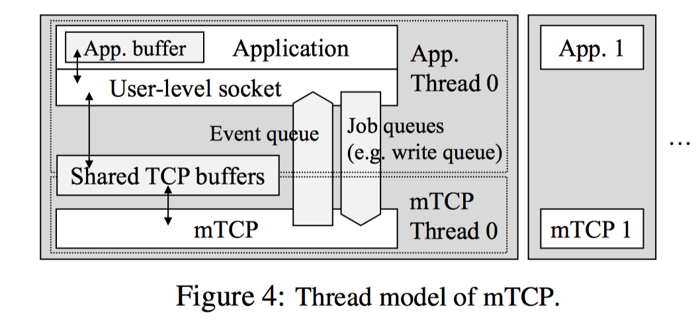
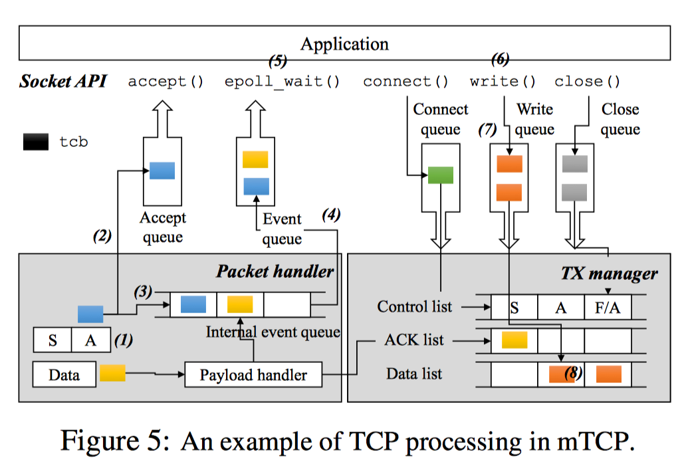

# mTCP: A Highly Scalable User-level TCP Stack for Multicore Systems

## 0x00 论文简介

在多核系统上，当存在大量的小型消息事务时，操作系统无法充分利用CPU的性能，存在性能瓶颈。针对该问题，作者提出了mTCP-一个应用于多核系统的高性能用户级TCP堆栈.作者设计将开销巨大的系统调用转换成一个单一的共享内存参数，使能高效的流级别的事件集合，和执行批量包I/O。 作者在一个8-core的机器上评估表明，mTCP在短消息传输的性能上面相比最新的Linux的TCP协议栈提高了25倍， 相比迄今已知的表现最好的系统研究提高了3倍。相比Linux协议栈它也提高了当前各种流行的应用程序33%至320%性能。

## 0x01 主要内容

#### 问题：

在当前TCP连接中，大部分的消息包都是小尺寸的。在蜂窝网络中，超过90%的TCP包都小于32kb，超过50%的包小于4KB。

 mTCP设计有三个明确的目标：TCP协议栈多核上面的可扩展性；易于使用，易于部署

而当前的Linux Kernel架构在处理小封包的性能存在很大瓶颈，比如：

1. Lack of connection locality

   缺乏连接局部性。在多线程通信应用中，我们往往共享同一个监听套接字。而这种运行模式回导致，多个线程会互相竞争使用套接字的接受队列，导致性能的下降。 此外，执行处理TCP连接的内核代码的核心可能与运行实际发送和接收数据的应用程序代码的核心不同。 由于CPU缓存未命中和缓存线共享增加，这种连接局部性的缺乏会引起额外的开销。

2. Shared file descriptor space:

   共享文件描述符空间：在符合POSIX的操作系统中，文件描述符（fd）空间在进程中共享。而在处理大量并发连接的繁忙服务器中，多线程之间的竞争锁会带来性能开销。 反过来，套接字的文件描述符的使用还为通过Linux虚拟文件系统（VFS）创造了额外的开销，这是一个用于支持常见文件操作的伪文件系统层。 

3. Inefficient per-packet processing

   不利于每个数据包的处理：目前，操作系统会对每一个包进行单独处理。然而，这种处理模式会带来更多的开销。

4. System call overhead

   系统调用的开销：在大量小封包并发连接到来时，传统的套接字需要频繁的用户/内核模式切换。频繁的系统调用会污染处理器状态（比如高速缓存、分支预测表），从而导致性能下降。另外，用户/内核模式的切换也会导致一定的开销。

#### 已有的解决方案：

1. 修改kernel的，如MegaPipe，FlexSC
2. 在用户空间提供高速的Packet I / O，通常是直接跟网卡操作，跳过内核，如netmap，DPDK，PSIO。

#### 已有方案的不足：

1. 修改内核代码太繁琐，麻烦，无法很好应用到真正的工业服务器上
2. 用户空间库的缺点
3. 没有统一的用户接口，导致开发者需要处理很多额外的工作，开发困难，且跨平台不稳定

#### mTCP解决思路：

mTCP的设计目标是在多核系统上实现高可扩展性，同时保持与现有多线程事件驱动应用程序的向后兼容性。

整体设计实现如下：

其中用到的思路要点如下：

1. 不修改kernel，只修改用户空间库。
2. 为每个核维护自己的数据结构，包括tcb、socket的buffer以及相应队列，从而避免竞争锁问题，并增加缓存性能
3. 为了保证多网卡下的高效处理，mTCP采用PacketShader I / O引擎（PSIO）来提供高效率的事件驱动的数据包I / O接口，提供了ps_select。
4. 避免频繁用户/内核切换的开销，mTCP采用一个名为零线程的TCP来提供功能，以用户态的模式来进行交互。
5. 高效的TCP timer管理，并进行优先级管理，对小封包连接进行优化，保证性能
6. 批处理网络报文，使用batch，来平摊额外开销。

简单来讲，mTCP分别为每个应用线程创建一个TCP线程，并将该线程绑定到一个物理CPU核上，从而避免了不同核、不同线程互相的竞争与干扰。与此同时，mTCP通过将系统调用转换为内部进程间通信来避免高昂的用户/内核切换开销，从而提高整个TCP协议栈的性能。

更细节来看，mTCP主要分为两个模块：User-level TCP stack和User-level packet I/O library（参考5）

###### User-level packet I/O library

mTCP没有采用之前一些系统的做法，mTCP扩展了PacketShader I/O engine(PSIO)，使用了新的事件驱动接口ps_select()，类似于select()，简单来说就是I/O复用，但是不同于select()的是，ps_select()只操作指定感兴趣的NIC上的TX/RX队列。

> 之前的做法：使用polling（轮询）来处理数据包，而polling会消耗大量的CPU资源，这与mTCP想要实现的目标是有冲突的。

###### User-level TCP stack

实现了用户态下的TCP栈，这样的好处是减少了系统调用，将系统调用转换成了用户层的函数调用。

如上所示，Application使用mTCP库函数通过共享缓存与mTCP线程通信。共享缓存的唯一访问入口就是库函数，这样可以保证内部TCP数据的共享安全性。当库函数需要修改共享数据时，只需要简单的将请求放到job queue。来自于不同流的多个请求在一个循环内被堆积在jobqueue中，当mTCP获得CPU后，便对这些请求进行批处理。来自于mTCP线程的flow events会被放入event queue，处理方式同job queue。

#### mTCP运行过程

mTCP线程从NIC的RX队列中读取一批数据包，并将它们传递给遵循标准TCP规范的TCP包处理逻辑。对于每一个数据包，mtcp首先会在流哈希表搜索相应流的tcp控制块(tcb)。如下图所示，在服务端收到一个SYN/ACK数据包的ACK后，新连接的tcb将会被放到accept queue（2），并为监听套接字生成一个read event（3）。如果有新数据包到达，mtcp会copy数据包的负载到套接字的read buffer并生成一个read event放到internal event queue。同时mtcp会生成一个ACK数据包放到TX manager的ACK列表中。

当批处理完收到的数据包后，mtcp会将queued中的event刷新到应用层的event queue（4）中，并通过信号唤醒应用层。当应用层被唤醒后，使用epoll批处理多个事件（5），并写入来自多个流的响应而没有上下文切换。每个套接字的write()调用写数据到send buffer（6），并将tcb放到write queue（7）。后面，mtcp会收集需要发送数据的tcb，并放到send list（8）。最后通过packet I/O系统调用将list中的数据包发送出去，并将它们传输到NIC的TX queue。

## 0x02 个人思考

整篇文章结构很棒，令读者可以很快地抓到细节。该文章详细地讲述了当前内核在面临大量并发TCP连接过程中会遇到的性能问题及一些解决方案，为我补充了这一方面的空白。

另外，这篇文章对其的设计与实现（还有源码），讲的很详细，学习到了很多。

## 0x03 参考

1. https://www.usenix.org/node/179774
2. https://www.usenix.org/conference/atc14/technical-sessions/presentation/mTCP-highly-scalable-user-level-tcp-stack-multicore
3. http://shader.kaist.edu/mTCP/
4. [https://www.slideserve.com/bertha/mTCP-a-highly-scalable-user-level-tcp-stack-for-multicore-systems](https://www.slideserve.com/bertha/mTCP-a-highly-scalable-user-level-tcp-stack-for-multicore-systems)
5. [https://allen-kevin.github.io/2017/11/18/%E7%94%A8%E6%88%B7%E6%80%81%E5%8D%8F%E8%AE%AE%E6%A0%88%E4%B9%8BmTCP/](https://allen-kevin.github.io/2017/11/18/%E7%94%A8%E6%88%B7%E6%80%81%E5%8D%8F%E8%AE%AE%E6%A0%88%E4%B9%8BmTCP/)